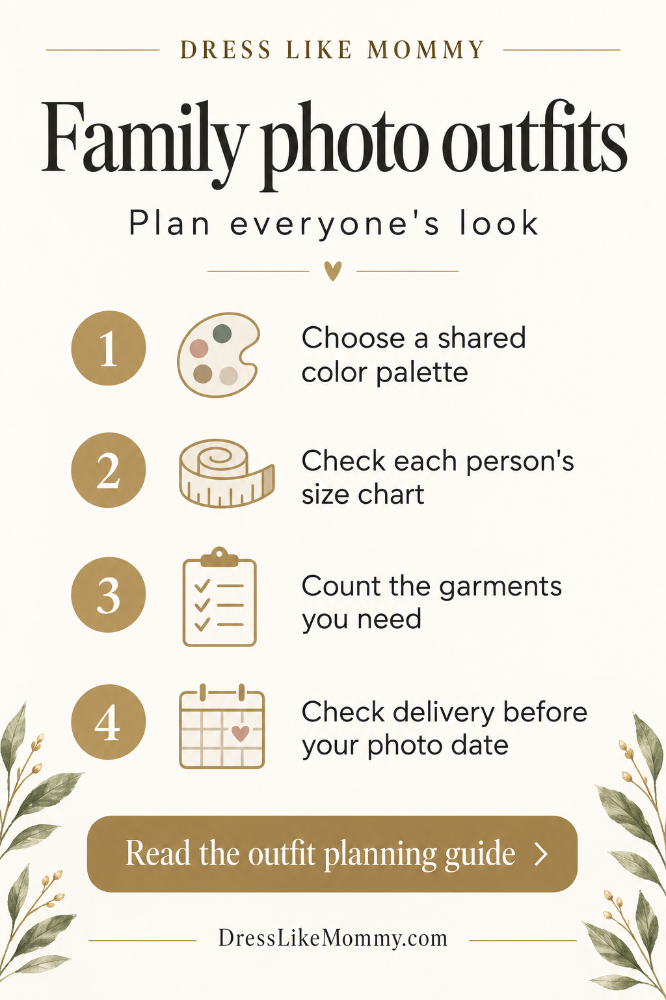

# September 11 owner-plan implementation

Confidence: H for local changes and checked documentation; M for channel recommendations; acquisition results remain unknown. The supplied September 10 plan is now reconciled with the existing work. This is an evidence/asset packet; ops/marketing remains the only command layer. Decision: DLM-DEC-2026-09-11-PINTEREST-MANUAL-SALES-PLAN.

## What changed

| Area | Implemented local result | Remaining live requirement |
|---|---|---|
| Paid objective | Current PAID_CAMPAIGN_SPEC.json now proposes one manual Sales campaign, Pins creative source, explicitly selected completed Checkout, one provisional US/English adult-shopping group and two distinct creatives. Exact prior Consideration proposal archived. | Actual account controls, two qualified assets, current purchase/consent receipt, economics and exact spending authority. No native campaign was saved. |
| Budget meaning | USD 5/day is a starting proposal only; fixed daily versus lifetime/average daily are separated. No invented Sales spend-limit control or implicit USD 150/month commitment. Total cap, duration, max loss and approved CPA stay null. | Read back native controls and approve a coherent enforceable exposure after economics. The historical USD 80 combined ceiling and old USD 15/72h proposal are not current authority. |
| Organic production | One finished P1 family-photo checklist image, exact existing copy/link preserved. Twelve capacity slots combine completed Sunshine, P1-P6 and five later concepts, including two real-video concepts. | Correct native profile/board, duplicates, composer/mobile crop and tagged clickthrough before each release. No Pin was uploaded, scheduled or published in this turn. |
| Attribution | Existing Sunshine and P1-P6 pinterest/social tracking retained; paid creatives use distinct paid_social links. | Never change old cohorts to match a new example UTM. Reporting classification and attribution windows remain explicit. |
| Product truth | Keep adult-plus-child quantity/availability and source/rights checks; preserve parent item_group_id/featured-image guard. | Feed primary images must remain truthful as well as correctly grouped; hold incompatible cohorts instead of rewriting all thumbnails or declaring supplier stock guaranteed. |
| Tracking | Existing managed integration preserved. Page/product callback proof, unresolved consent transition and CAPI receiver gaps retained. | Current consent approval and stable native handback still pending. A debug grant does not verify the real banner. Post-upgrade purchase receipt/dedup remains required. |

## Finished next creative: existing P1

Title: **Family Photo Outfit Checklist: Plan Every Person's Look**

Description: Planning family photos? Start with a shared color palette, then choose each person's outfit and size. Our guide helps you coordinate clothes you already own with matching pieces you want to add. Check the current product size charts and delivery estimates before ordering.

The [P1 release packet](P1_RELEASE_PACKET_20260911.json) includes alt text, exact original tracking URL, original-copy hash, image hash, 1024 × 1536 dimensions, AI disclosure flags and the remaining native checks. The built-in image_gen tool produced the original graphic; [exact final prompt](creative/p1_family_photo_checklist_v1_prompt.txt). It contains no photographed garment, model, price, inventory, delivery-time or PDF-download claim. It is **local and unpublished**. The current user plan does not silently reactivate the already fulfilled one-Sunshine publication authority; evaluate the exact reviewed P1 scope at its final publication step.

Public September 11 readback confirms the [destination guide](https://www.dresslikemommy.com/blogs/news/what-to-wear-for-family-photos-matching-outfit-ideas) contains separate-person planning, exact product size charts, item counts, delivery timing and Rainbow/Pastel Bloom links. This is content existence, not a native mobile/checkout/UTM acceptance test. Source copy in the organic owner's pins.json is byte-unchanged.

## Capacity and economics

[Content register](CONTENT_REGISTER_20260911.json):12 slots including the already published Sunshine Pin;10 image slots and2 video concepts. P1 has a finished asset; P2-P6 remain existing copy needing assets; later five concepts need source/destination proof. Candidate dates are an unscheduled proposal, with at most 3 total Pins per rolling 7 days. Shift/skip blocked slots rather than catch up with repetitive posts. Native scheduling's10 pending / 30 days limit does not become a quota. Each released Pin gets its own actual-date cohort; Sunshine reviews stay September 18/25 and October 11.

[Economics worksheet](PILOT_ECONOMICS_20260911.json) preserves dated scenarios rather than substituting the plan's illustrative USD 90 basket:

| Dated Sunshine scenario | Merchandise | Floor of merchandise/6.5 |
|---|---:|---:|
| One child tee | USD 21.99 | USD 3.38 |
| One adult tee | USD 24.99 | USD 3.84 |
| Adult+child | USD 46.98 | USD 7.22 |
| Three tees | USD 71.97 | USD 11.07 |

These limits are not approved CPAs or profit proof. Actual current basket costs, destination fulfillment, fees, duties/taxes borne, returns/refunds and overhead are still missing. Qualifying spend must meet both the 6.5× ROAS constraint using the agreed revenue definition and the existing profit requirement using verified contribution. Do not divide one observed five-item shipping charge into forecasts for smaller baskets. No speculative lifetime value.

## Verified 2026 points and limits

The independent [primary-source check](PLAN_SOURCE_CHECK_20260911.md) confirms Sales/Pins/Checkout distinctions, full Performance+ All Products/automatic-retargeting limits, separate automatic bidding, budget semantics and native scheduling. Account-specific availability is still unknown. [Pinterest Sales objectives](https://help.pinterest.com/en/business/article/simplified-objectives), [budget modes](https://help.pinterest.com/en/business/article/set-up-campaign-budgets), [native scheduling](https://help.pinterest.com/en/business/article/schedule-pins).

Shopify's [checkout-upgrade documentation](https://help.shopify.com/en/manual/checkout-settings/customize-checkout-configurations/upgrade-thank-you-order-status) confirms the August 26 deadline and automatic upgrades. It does not prove this store's purchase path. [Pinterest Trends](https://help.pinterest.com/en/business/article/pinterest-trends) normalizes search indices and requires account access for advertiser features; proposed keywords are not verified search volume. The [Merchant guidelines](https://policy.pinterest.com/en/merchant-guidelines) announce changes effective November 12, 2026; that is a future effective date, not current enforcement or a newly created reminder.

## Integration verified September 11

The reviewed update was applied to ten existing canonical records after Merchant released the shared files. The cockpit was regenerated; integration passed 25/25 with zero side-document risks, strict continuity passed all ten checks, and the scoped diff check passed. Six exact comparisons confirmed that peer task rows, the parent's cockpit content and earlier decision/worklog history were preserved. The full paid-control block is byte-unchanged. The [final verification receipt](PLAN_INTEGRATION_VERIFICATION_20260911.json) supersedes the earlier pending handoff for integration status; it does not certify live tracking, publication or sales.

## One next action

Resolve the existing temporary-consent test question and normal native handback. That enables controlled cleanup and receiving-event diagnosis; no new consent grant is inferred from the research plan. In parallel, P1 is ready for its native identity/duplicate/asset/link review and exact publication-scope check. No customer-list upload, billing/spend, whole-catalog campaign, theme publication, new scheduler or support message occurred.

Continue through ops/prompts/paid-growth-ai-army-continuation-prompt.md. Preserve the September 11 callback/consent checkpoint and completed September 10 live repairs. This plan replaces only the primary local campaign recommendation and obsolete content-preparation instructions.
